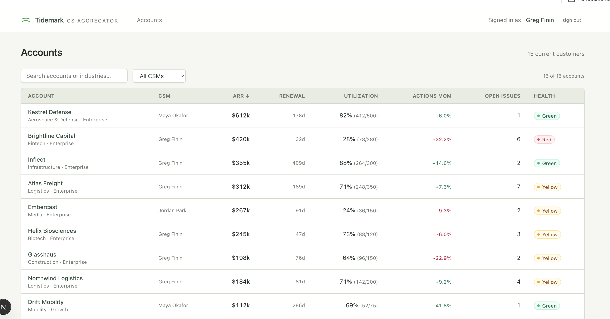
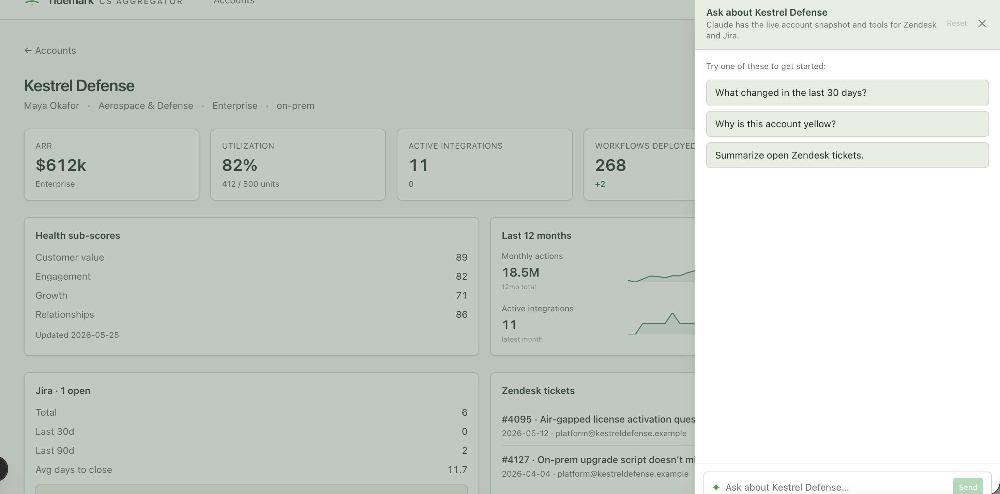

# tidemark-cs-aggregator

Customer-success aggregator — a production-grade Next.js explorer over the
same upstream signals a CSM team touches every day: warehouse-backed account
health, CRM ownership and contract data, support tickets, engineering issues,
usage trends, and an integrated Claude chat sidebar with tool-use access to
the full account context.

> **Note on this repo.** Note on this repo. This is a portfolio rebuild of a CS aggregator based on a system I've built professionally. The architecture, LLM tool-use loop, and deployment shape are the same; the company name, customer data, and domain specifics are fictional. See ARCHITECTURE.md for the deployment-vs-demo split.





## What's here

- **`/`** — sortable, filterable account list. Health pills, CSM filter,
  search. The CSM filter is cookie-persisted (`tm.csm.filter`) so each user
  lands on their book of business by default.
- **`/accounts/[id]`** — header (CSM, industry, plan, deployment, renewal
  countdown, health pill, "Suggest next step" button), 5-tile stat row,
  health sub-scores, 12-month sparkline trends, Jira issue summary panel,
  Zendesk ticket list, contract details — and a floating chat sidebar with
  tool-use access to Zendesk, Jira, and trend queries.
- **"Suggest next step"** — one-click Claude call that takes a pre-computed
  signals object (renewal proximity, weakest sub-score, usage flags, Jira
  velocity) and produces a single imperative recommendation. Synthesis-only
  prompt, Haiku-cheap, deterministic structure.
- **`infra/`** — reference CDK stack (Fargate + Tailscale + Secrets Manager
  + OIDC deploy role). Included for reference; the demo runs locally.

## Running it locally

```bash
brew install node              # Node 20+
npm install
cp .env.example .env           # fill in ANTHROPIC_API_KEY (optional)
npm run dev                    # → http://localhost:3000
```

You'll hit `/login` first — click "Sign in as Greg Finin" to set the demo
session cookie, then land on the accounts table.

The LLM features (chat sidebar, "Suggest next step") only work if
`ANTHROPIC_API_KEY` is set in `.env`. Without it, both gracefully render a
"key not configured" message and the rest of the app works unchanged.

## Project layout

```
tidemark-cs-aggregator/
├── app/
│   ├── layout.tsx               # Tidemark-branded header, auth-gated chrome
│   ├── page.tsx                 # /  (accounts list)
│   ├── accounts-table.tsx       # client: sort / filter / cookie persistence
│   ├── accounts/[id]/           # detail page (layout, page, panels)
│   ├── login/                   # demo auth — sets cookie, server-action redirect
│   └── api/
│       ├── chat/route.ts        # Claude tool-use loop (3 tools, prompt-cached)
│       ├── suggest-next-step/   # signals → Claude → recommendation
│       └── health/              # liveness probe for ECS health checks
├── components/
│   ├── chat-sidebar.tsx         # floating Claude chat with suggestions + reset
│   ├── sparkline.tsx            # pure-SVG 12-mo sparkline, no chart library
│   ├── health-badge.tsx         # pill + status dot
│   └── delta.tsx                # MoM/WoW indicator chip
├── lib/
│   ├── types.ts                 # canonical AccountRow shape
│   ├── fixtures.ts              # demo data layer (same signatures as warehouse adapter)
│   ├── account-signals.ts       # pre-computes structured signals for suggest-next-step
│   ├── jira.ts                  # mock Jira client (demo)
│   ├── zendesk.ts               # mock Zendesk client (demo)
│   ├── csm.ts                   # HubSpot owner ID → CSM name resolver
│   ├── auth.ts                  # demo auth helpers
│   └── format.ts                # ARR / pct / days / number formatters
├── middleware.ts                # bounces unauthenticated requests to /login
├── data/
│   ├── accounts.json            # 15 fictional accounts with full field shapes
│   ├── trends.json              # 12 months × 5 metrics × 15 accounts
│   ├── jira-issues.json         # Jira issue fixtures per customer
│   └── tickets.json             # Zendesk ticket fixtures per customer
├── scripts/
│   └── generate-trends.mjs      # regenerates trends.json deterministically
└── infra/                       # CDK reference (Fargate + Tailscale + OIDC deploy)
```

## Try this

Once `ANTHROPIC_API_KEY` is set:

1. Load `/accounts/TM_00091` (Brightline Capital — the dramatic at-risk
   story) and click **Suggest next step**. The signals object (imminent
   renewal, Red health, actions −32% MoM, utilization 28%) should produce a
   one-line "lock a renewal meeting this week" recommendation.
2. Open the chat sidebar, click **"Why is this account yellow?"** — Claude
   has the full snapshot inline so it shouldn't need a tool call. Sub-100
   word answer citing specific sub-scores.
3. Click **"Summarize open Zendesk tickets"** — triggers the
   `list_support_tickets` tool, then summarizes. Watch the tool-use loop
   work end-to-end.

## Design highlights

- **One source-of-truth account snapshot** passed inline as cache-controlled
  system context. The model only calls tools for things the snapshot can't
  carry (ticket titles, individual issue URLs, time series).
- **Bounded tool-use loop** (`MAX_TURNS = 6`) — caps cost on pathological
  inputs.
- **Forced structured signals** for "Suggest next step" — the model gets a
  pre-computed signals object with every threshold already applied, so its
  job is synthesis rather than math. Deterministic output structure.
- **Daily cache boundary** — both the accounts list and trends invalidate at
  the same fixed UTC boundary as the nightly analytical refresh. No rolling TTLs.
- **Same exported signatures across data layers** — `listAccounts`,
  `getAccount`, `getAccountTrend` in `lib/fixtures.ts` match the warehouse
  adapter shape exactly. The downstream UI components are identical between
  the two paths.
